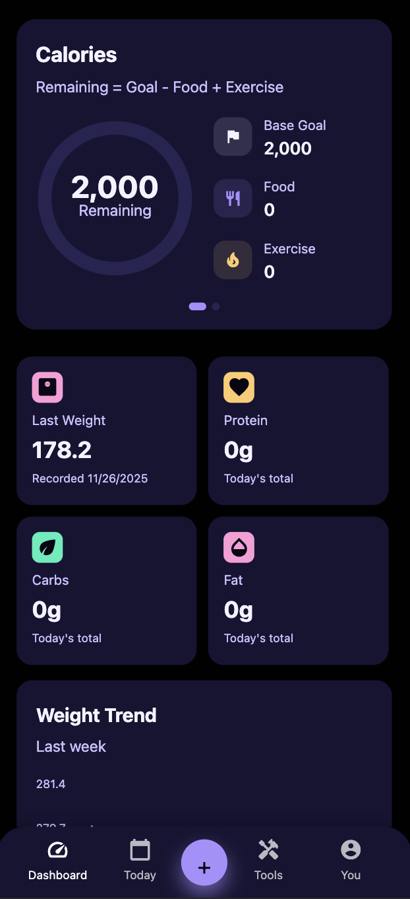
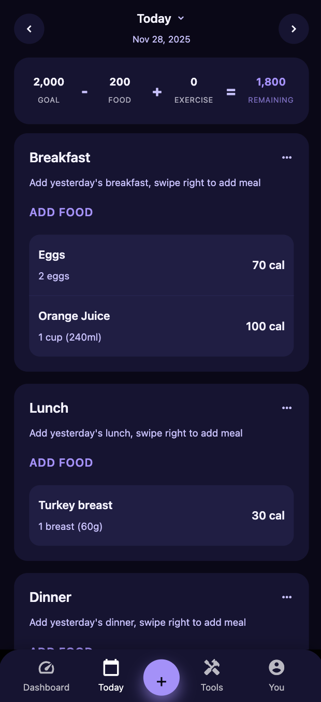
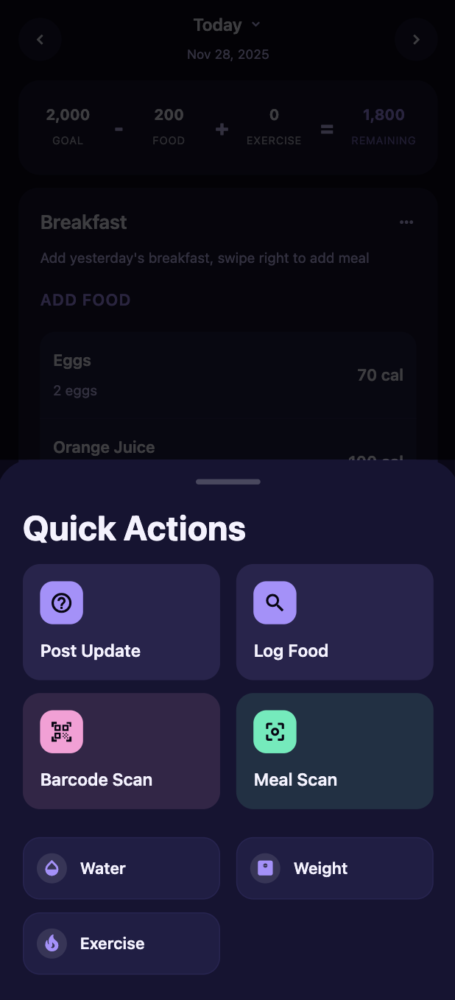
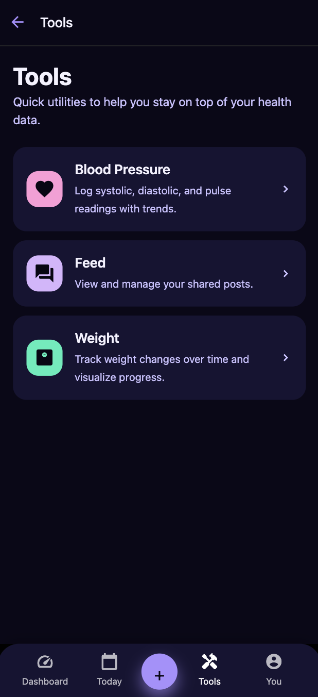
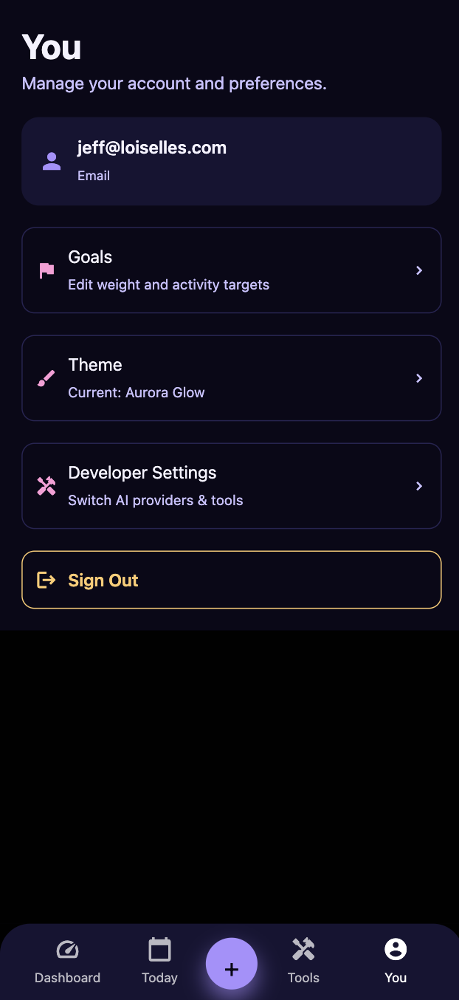
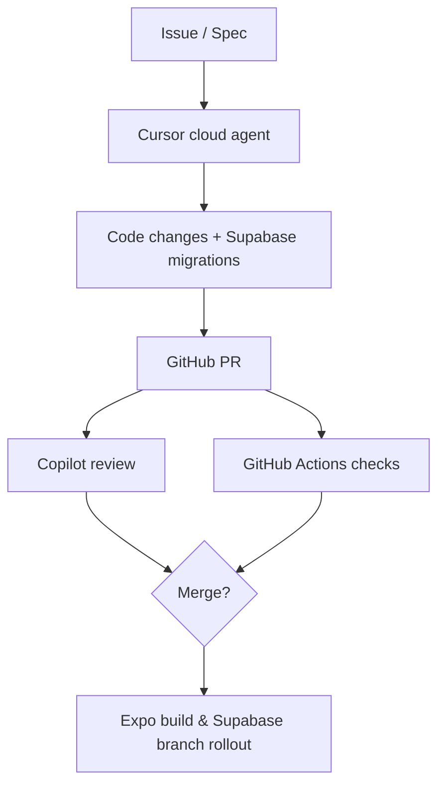

# 🍽️ MagicMeal - A Self-Hosted Alternative

AI-powered 💪 calorie tracker 🥗 for food, weight ⚖️, blood pressure ❤️, and recipe tracking 🍳 — built with React Native + Expo. Track your meals effortlessly with barcode scanning and AI photo recognition.

## 📸 Screenshots

---

<p align="center">
  <a href="img/screen-01.png" alt="MagicMeal logging view">
        </a>
  <a href="img/screen-02.png" alt="MagicMeal nutrition summary">
        </a>
  <a href="img/screen-03.png" alt="MagicMeal meal insights">
        </a>
  <a href="img/screen-04.png" alt="MagicMeal goals screen">
        </a>
  <a href="img/screen-05.png" alt="MagicMeal progress trends">
        </a>
</p>

## ✨ Overview

A modern, AI-powered food tracking app built with React Native and Expo. Track your meals effortlessly with barcode scanning and AI photo recognition.

## ✨ Features

- **📊 Daily Food Logging** - Track calories, protein, carbs, and fat
- **📱 Barcode Scanner** - Scan food barcodes for instant nutrition lookup
- **🤖 AI Photo Recognition** - Take a photo of your meal and AI identifies the food
- **🔍 Food Database Search** - Search thousands of foods from Open Food Facts
- **📈 Progress Tracking** - Monitor your daily nutrition goals

## 🚀 Get Started

### Prerequisites

- Node.js 18+
- npm or yarn
- Expo CLI
- iOS Simulator (Mac) or Android Emulator

### Installation

1. Install dependencies

   ```bash
   npm install
   ```

2. Start the app

   ```bash
   npx expo start
   ```

3. Set up Supabase (local backend)

   ```bash
   brew install supabase/tap/supabase   # or: npm install -g supabase
   supabase login                       # first time only
   supabase start
   ```

   The CLI uses `supabase/config.toml` and `supabase/migrations` to boot a local stack, apply migrations, and generate a `.env` file with the API URL and anon key. Copy those values into your Expo env file (see below) as `EXPO_PUBLIC_SUPABASE_URL` and `EXPO_PUBLIC_SUPABASE_ANON_KEY`. Keep the Supabase services running in a separate terminal while developing. If you need to reapply schema changes, run `supabase migration up`.

4. Press `i` for iOS simulator or `a` for Android emulator

## 🧠 AI Development Experiment

MagicMeal doubles as an ongoing AI-first development experiment. We lean on Cursor cloud agents for day-to-day implementation work—they can open PRs, take ownership of GitHub issues, and update Supabase schemas by editing migrations directly from the repo. Copilot handles pull-request reviews for an automated second set of eyes, while comprehensive GitHub Actions checks keep merges safe. For database work, we spin up Supabase branches to preview schema changes end-to-end before shipping. This workflow lets us prototype quickly while keeping architectural decisions and quality controls auditable.



## 📸 AI Photo Recognition Setup

The app includes a **mock AI implementation** for meal photo recognition. To enable real AI analysis, integrate one of these services:

### Option 1: OpenAI Vision API (Recommended)
Best accuracy for food recognition.

```bash
npm install openai
```

Add to `app/photo-scanner.tsx`:
```typescript
import OpenAI from 'openai';

const openai = new OpenAI({
  apiKey: process.env.OPENAI_API_KEY,
});

const analyzeImage = async (imageUri: string) => {
  const response = await openai.chat.completions.create({
    model: "gpt-4-vision-preview",
    messages: [
      {
        role: "user",
        content: [
          { type: "text", text: "Analyze this meal and provide: food items, calories, protein, carbs, fat for each item. Return as JSON array." },
          { type: "image_url", image_url: { url: imageUri } }
        ],
      },
    ],
  });
  // Parse response...
};
```

### Option 2: Google Cloud Vision API
Good for general food detection.

```bash
npm install @google-cloud/vision
```

### Option 3: Clarifai Food Model
Specialized for food recognition.

```bash
npm install clarifai
```

### Option 4: Custom TensorFlow Lite Model
For offline, privacy-first recognition.

```bash
npm install @tensorflow/tfjs @tensorflow/tfjs-react-native
```

## 🗄️ Data Storage

Currently uses AsyncStorage for local data persistence. For production:

### Add Cloud Sync (Optional)
```bash
npm install @supabase/supabase-js
# or
npm install firebase
```

### Add SQLite for Better Performance
```bash
npx expo install expo-sqlite
```

## 🔑 API Keys Required

Copy `env.example` to `.env` and fill in your keys:

```bash
cp env.example .env
```

```env
# Supabase backend (generated after `supabase start`)
EXPO_PUBLIC_SUPABASE_URL=http://127.0.0.1:54321
EXPO_PUBLIC_SUPABASE_ANON_KEY=your_local_anon_key
SUPABASE_SERVICE_ROLE_KEY=your_local_service_role_key

# For AI Photo Recognition
OPENAI_API_KEY=your_key_here

# Optional: Premium food database
EXPO_PUBLIC_NUTRITIONIX_APP_ID=your_id_here
EXPO_PUBLIC_NUTRITIONIX_APP_KEY=your_key_here

# Optional: Sentry monitoring (keep blank/false for public forks)
EXPO_PUBLIC_SENTRY_DSN=
EXPO_PUBLIC_SENTRY_ENVIRONMENT=development
EXPO_PUBLIC_SENTRY_ENABLE_LOGS=true
EXPO_PUBLIC_SENTRY_SEND_DEFAULT_PII=false
EXPO_PUBLIC_SENTRY_ENABLE_FEEDBACK=false
EXPO_PUBLIC_SENTRY_ENABLE_REPLAY=false
EXPO_PUBLIC_SENTRY_REPLAY_SAMPLE_RATE=0.1
EXPO_PUBLIC_SENTRY_REPLAY_ON_ERROR_SAMPLE_RATE=1
```

## 📱 Features Roadmap

- [x] Daily calorie tracking
- [x] Barcode scanner
- [x] AI photo recognition (mock)
- [x] Food search
- [ ] Real AI integration
- [ ] Meal favorites & templates
- [ ] Weight tracking
- [ ] Progress charts
- [ ] Custom food entry
- [ ] Recipe builder
- [ ] Water tracking
- [ ] Exercise logging
- [ ] Social features
- [ ] Meal planning

## 🎨 Tech Stack

- **Framework**: React Native (Expo)
- **Language**: TypeScript
- **Routing**: Expo Router
- **Storage**: AsyncStorage
- **Camera**: expo-camera
- **Barcode**: Built-in barcode scanner
- **Image Picker**: expo-image-picker
- **Food Database**: Open Food Facts API (free)


## 📄 License

Affero

## 🤝 Contributing

Contributions welcome! This is an open-source project.

### 🧾 Conventional Commits & Workflow

- Run `npm run commit` (Commitizen) to get a guided prompt for the conventional commit message (`type(scope): subject`). Keep scopes aligned with top-level folders (e.g., `types`, `supabase`, `services`) so shared types stay centralized in `types/index.ts`.
- Husky automatically runs `commitlint` via the `commit-msg` hook, so commits created outside Commitizen (Cursor’s commit composer, VS Code Source Control, etc.) are still validated.
- Recommended editor add-ons: *Conventional Commits* and *GitLens* (VS Code/Cursor) for inline history + message templates, plus keep ESLint warnings visible before committing.
- Typical flow: `git pull` → build/test changes → `npm run lint` → stage files → `npm run commit` → push + open PR. Cursor users can also bind a custom slash command to `npm run commit` for quick access.

### 🚀 Manual Releases (semantic-release)

- When you’re ready to tag a build, open GitHub → *Actions* → **Manual Release** workflow → **Run workflow**. It inspects commits since the last tag, bumps the version, updates `CHANGELOG.md`, and cuts a GitHub Release.
- The workflow relies on Conventional Commit history, so feel free to reword commits before merging to keep the log clean.
- Release automation is disabled by default—no tags are created until you explicitly trigger the workflow_dispatch run.

## 📞 Support

Open an issue on GitHub for bug reports or feature requests.
